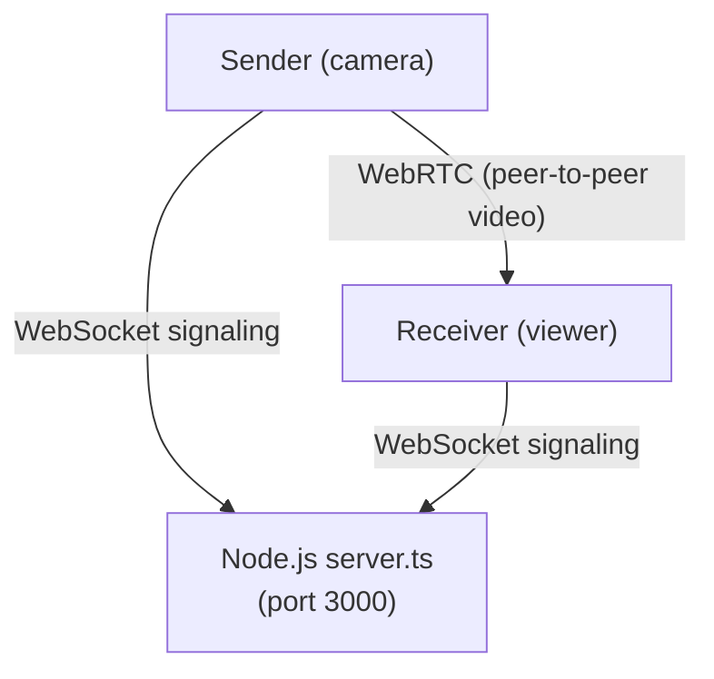

# tiny-stream

One-way video + audio streaming between your devices — open a URL, pick Send or Receive, done.

## Quick Start

```bash
npm install
npm start
```

The server prints your local network URL:

```
  ╔══════════════════════════════════════════════╗
  ║         tiny-stream is running!         ║
  ╠══════════════════════════════════════════════╣
  ║  Local:   http://localhost:3000         ║
  ║  Network: http://192.168.1.42:3000      ║
  ╚══════════════════════════════════════════════╝
```

Open the **Network** URL on any device connected to your home Wi-Fi/LAN.

## How It Works

1. Open the URL on **two devices** (laptops, desktop, phone — anything with a browser).
2. Both devices enter the same **room name** (default: `home`).
3. On one device, tap **Send Video** — it opens your camera/microphone and starts streaming.
4. On the other device, tap **Receive Video** — it shows the live feed with audio.

That's it. No accounts, no installs, no cloud.

## Architecture



- **Video + audio** travels directly between devices via WebRTC (peer-to-peer). The server never sees your stream.
- **Signaling** (tiny JSON messages to set up the connection) goes through the Node.js WebSocket server.

## Features

- **One-way streaming** — one sender, multiple receivers per room
- **Camera switching** — sender can switch between cameras on the fly
- **Room-based** — run multiple independent streams with different room names
- **Mobile-friendly** — works on phone browsers (Chrome, Safari, Firefox)
- **Audio + video** — streams both camera and microphone
- **Zero config** — no TURN servers needed on a home network

## Requirements

- Node.js 18+
- Devices on the same local network
- A modern browser (Chrome, Edge, Firefox, Safari)

## Configuration

| Env Variable | Default | Description |
| ------------ | ------- | ----------- |
| `PORT`       | `3000`  | Server port |

```bash
PORT=8080 npm start
```

## Troubleshooting

**Camera not working on phone?**  
Mobile browsers require HTTPS for camera access, except for `localhost`. If accessing via IP on a phone, some browsers (especially iOS Safari) may block camera access. Chrome on Android generally allows it over plain HTTP on local networks.

**Can't connect between devices?**  
Make sure both devices are on the same Wi-Fi/LAN. Check that your firewall allows connections on port 3000.
